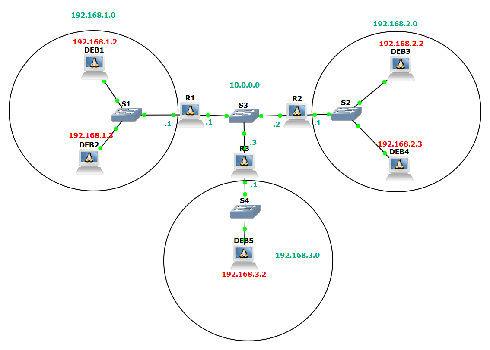
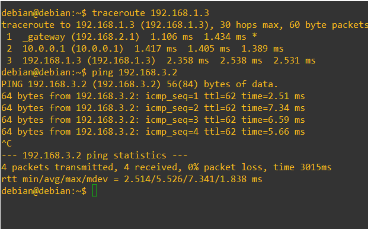

# Routage-Linux sur GNS3




Le réseau est composé de 4 réseaux :
* 192.168.1.0/24
* 192.168.2.0/24
* 192.168.3.0/24
* 10.0.0.0/24 (entre les routeurs)  

Le routage a été configuré dans les trois postes Debian faisant office de routers (R1, R2, R3) :
Décommenter `net.ipv4.ip_forward=1` dans `/etc/sysctl.conf` 
Puis `sysctl -p` pour opérer le changement  

Les configurations sont telles que suit : 

##### CONF R1
```
iface ens4 inet static
    address 192.168.1.1
    netmask 255.255.255.0

iface ens5 inet static
    address 10.0.0.1
    netmask 255.255.255.0
    
up ip route add 192.168.2.0/24 via 10.0.0.2
up ip route add 192.168.3.0/24 via 10.0.0.3
```
##### INTERFACE R2
```
iface ens4 inet static
    address 192.168.2.1
    netmask 255.255.255.0

iface ens5 inet static
    address 10.0.0.1
    netmask 255.255.255.0
    
up ip route add 192.168.1.0/24 via 10.0.0.1
up ip route add 192.168.3.0/24 via 10.0.0.3
```
##### INTERFACE R3
```
iface ens4 inet static
    address 192.168.3.1
    netmask 255.255.255.0

iface ens5 inet static
    address 10.0.0.1
    netmask 255.255.255.0
    
up ip route add 192.168.2.0/24 via 10.0.0.2
up ip route add 192.168.1.0/24 via 10.0.0.1
```
##### Exemple de conf de l'host DEB2  :
```
auto ens4
iface ens4 inet static
	address 192.168.1.2
	netmask 255.255.255.0
	gateway 192.168.1.1
```
	
Exemple de test : traceroute du réseau 2 vers le réseau 1 et ping du réseau 2 vers le réseau 3


